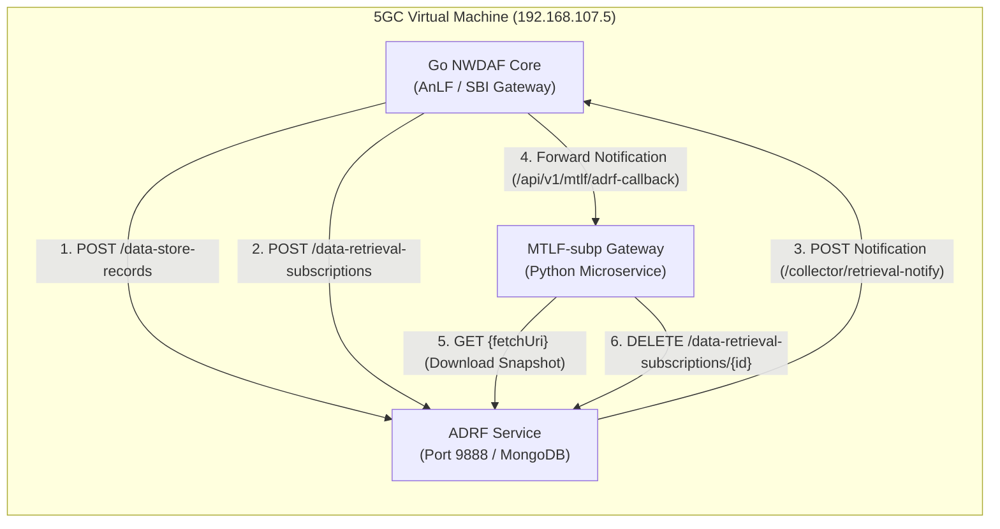
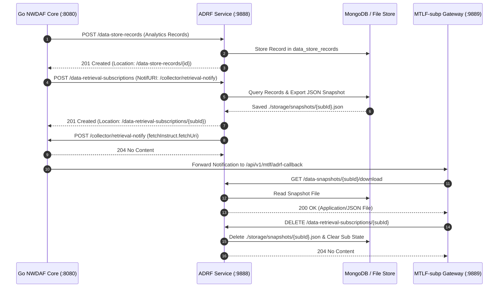

# ADRF (Analytics Data Repository Function)

This repository (`adrf`) implements the **Analytics Data Repository Function (ADRF)** microservice for 5G Core Networks, fully compliant with **3GPP TS 23.288**, **TS 29.575** (Stage 3), and OpenAPI 3.0 standards.

---

## 🏛️ Architecture & System Positioning

ADRF serves as the central storage repository for historical network analytics records and Machine Learning (ML) models within the 5G Core architecture. It aligns with the free5gc microservice framework and interacts directly with **NWDAF (`/home/king25158986/NWDAF`)** and **MTLF-subp (`/home/king25158986/MTLF-subp`)**.



---

## 🔄 Snapshot Export & Retrieval Lifecycle



---

## 🔑 Supported 3GPP Service Operations (TS 29.575)

### 1. `Nadrf_DataManagement` Service

#### `POST /nadrf-datamanagement/v1/data-store-records`
* Stores analytics data records collected from NWDAF / UPF into MongoDB / Memory store.
* **HTTP Response**: `201 Created` with `Location` header pointing to the created record URI.

#### `POST /nadrf-datamanagement/v1/data-retrieval-subscriptions`
* Subscribes to historical data retrieval.
* Triggers snapshot generation, exporting matched records into a local JSON snapshot file (`./storage/snapshots/{subscriptionId}.json`).
* Asynchronously sends a `NadrfDataRetrievalNotification` callback to the subscriber's notification URI (`http://192.168.107.5:8080/collector/retrieval-notify`) containing 3GPP compliant `fetchInstruct.fetchUri`.
* **HTTP Response**: `201 Created` with `Location: /nadrf-datamanagement/v1/data-retrieval-subscriptions/{subscriptionId}` and `NadrfDataRetrievalSubscription` response body.

#### `GET /nadrf-datamanagement/v1/data-snapshots/{subscriptionId}/download` (`fetchUri`)
* Provides RESTful HTTP GET dataset download for exported snapshot files.
* Allows consumers (such as `MTLF-subp`) to pull historical analytics data without requiring shared disk mounts.

#### `DELETE /nadrf-datamanagement/v1/data-retrieval-subscriptions/{subscriptionId}` (`RetrievalUnsubscribe`)
* Cancels an active data retrieval subscription.
* **Cleanup Lifecycle**: Removes the subscription from memory/MongoDB and automatically deletes the exported temporary snapshot JSON file (`./storage/snapshots/{subscriptionId}.json`).
* **HTTP Response**: `204 No Content`.

---

### 2. `Nadrf_MLModelManagement` Service

#### `POST /nadrf-mlmodelmanagement/v1/models`
* Registers newly trained ML model metadata and download URLs produced by NWDAF / MTLF.
* **HTTP Response**: `201 Created` with `Location` header.

---

## 📑 OpenAPI 3.0 Schema Alignment

ADRF strictly enforces OpenAPI 3.0 schemas specified in 3GPP TS 29.575:

```json
{
  "notifCorrId": "sub-12345",
  "timeStamp": "2026-07-30T09:00:00Z",
  "fetchInstruct": {
    "fetchUri": "http://192.168.107.5:9888/nadrf-datamanagement/v1/data-snapshots/sub-12345/download"
  }
}
```

---

## 🧪 Building & Running

### Building Binary
```bash
go build -o bin/adrf ./cmd/main.go
```

### Running Service
```bash
./bin/adrf --config ./config/adrfcfg.yaml
```

### Running Unit Tests
```bash
go test -v -short ./internal/sbi/processor/...
```
* **Test Status**: `100% PASSED` (0.012s).
