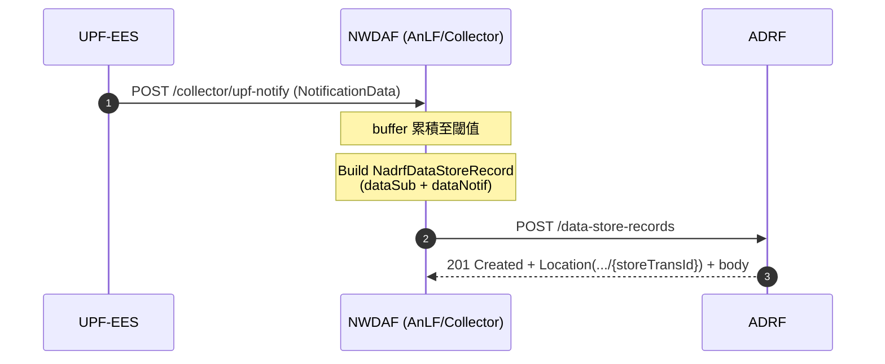
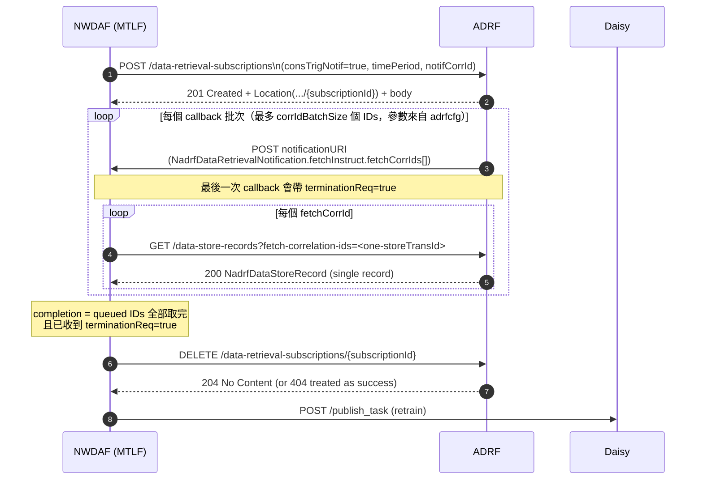

# ADRF1: SPEC-ALIGNED 設計稿（Store + Retrain RetrievalSubscribe(fetch)）

本文件依據目前最新討論更新，僅做盤點與設計分析，不修改 NWDAF 程式碼。

## 0. 本版範圍

### 0.1 In Scope

1. `store` 接點：`POST /data-store-records`。
2. NWDAF 收到 UPF notify 後，將資料寫入 ADRF（payload 走 `NadrfDataStoreRecord.dataSub + dataNotif`）。
3. retrain / FL 路徑使用 `POST /data-retrieval-subscriptions` + `fetch` 模式（`consTrigNotif=true`）。
4. `RetrievalNotify` callback 設計（`fetchInstruct`、`terminationReq`、去重與收斂）。
5. `correlationId` 與 `group` 的分流設計（client1/path1、client2/path2）。
6. 依 `config/5GC`（UPF 5 秒回報等）評估大時間窗資料拉取可行性。

### 0.2 Out of Scope（本版先不做）

1. OAuth2 正式串接（先 stub）。
2. accuracy monitor 經 ADRF retrieval（明確不做；保留現行 Mongo + memory）。
3. `data-set-id`（EnhDataMgmt）策略。

---

## 1. 當前系統事實（作為設計前提）

1. NWDAF 目前 UPF 入口為 `POST /collector/upf-notify`。
2. Group 訂閱在 NWDAF 內會先做 `groupId -> SUPI[]` 展開，再逐 SUPI 建立資料收集流。
3. `correlationId` 在現行程式語意是「訂閱流識別」，不是「group 識別」。
4. 現行 AnLF accuracy path：
   - 即時推論讀 memory ring buffer。
   - accuracy ground truth 主要讀 MongoDB（失敗才 fallback memory）。
5. 這一版 ADRF 的目的：
   - 線上資料持久化到 ADRF。
   - retrain 時可從 ADRF 拉歷史資料。
   - 不改動 accuracy 熱路徑。

---

## 2. Store 接點（沿用你們確認版 payload）

## 2.1 規格最小集合（必須）

規格關鍵：`NadrfDataStoreRecord` 需滿足 oneOf；本案走 `dataSub + dataNotif`。

### 建議請求體（具體範例，`dataSub` 對齊 TS 29.508 SMF 訂閱、`dataNotif` 對齊 TS 29.564 UPF 通知）

```json
{
  "dataSub": [
    {
      "smfDataSub": {
        "supi": "imsi-208930000000001",
        "notifUri": "http://192.168.107.5:8080/collector/notify",
        "notifId": "corr-session-001",
        "notifMethod": "PERIODIC",
        "repPeriod": 5,
        "eventSubs": [
          {
            "event": "UPF_EVENT",
            "upfEvents": [
              {
                "type": "USER_DATA_USAGE_MEASURES",
                "measurementTypes": [
                  "VOLUME_MEASUREMENT",
                  "THROUGHPUT_MEASUREMENT"
                ],
                "granularityOfMeasurement": "PER_SESSION"
              }
            ],
            "bundlingAllowed": true,
            "bundledEventNotifyUri": "http://192.168.107.5:8080/collector/upf-notify"
          }
        ]
      }
    }
  ],
  "dataNotif": {
    "upfEventNotifs": [
      {
        "correlationId": "corr-session-001",
        "notificationItems": [
          {
            "eventType": "USER_DATA_USAGE_MEASURES",
            "timeStamp": "2026-03-20T10:00:00Z",
            "startTime": "2026-03-20T10:00:00Z",
            "ueIpv4Addr": "10.10.0.1",
            "userDataUsageMeasurements": [
              {
                "volumeMeasurement": {
                  "totalVolume": 6800,
                  "ulVolume": 1200,
                  "dlVolume": 5600,
                  "totalNbOfPackets": 96,
                  "ulNbOfPackets": 30,
                  "dlNbOfPackets": 66
                },
                "throughputMeasurement": {
                  "ulThroughput": "16 Kbps",
                  "dlThroughput": "64 Kbps",
                  "ulPacketThroughput": "12 pps",
                  "dlPacketThroughput": "25 pps"
                }
              }
            ]
          }
        ]
      }
    ]
  }
}
```

### 欄位閱讀重點

1. `dataSub[0].smfDataSub.notifId` 與 `dataNotif.upfEventNotifs[*].correlationId` 應可對上。
2. `notificationItems[*].startTime` 建議作為主要 measurement timestamp。
3. `dataNotif` 建議保留原始 TS 29.564 形狀，不先壓平。

### 本版還不支援的 optional

1. `storeHandl`
2. `dataSetTag`
3. `dsc`
4. `suppFeat`

原因：先打通最小合法 store 與 retrain 可拉取能力。

## 2.2 Store 流程

1. NWDAF 收到 `/collector/upf-notify`。
2. 轉成 `NadrfDataStoreRecord(dataSub + dataNotif)`。
3. 呼叫 ADRF `POST /data-store-records`。
4. 接收 `201 Created`，除了 `Location(.../{storeTransId})` header，response body 也應包含建立完成的 `NadrfDataStoreRecord`；再記錄操作結果（可選：審計/追蹤）。
5. accuracy 路徑不依賴此回寫結果（避免牽動熱路徑）。

---

## 3. Retrieval 接點（僅 Retrain/FL，採 Subscription + fetch）

## 3.1 為何本版選擇 fetch 模式

1. 長時間窗（如過去 30 分鐘）資料量大。
2. `consTrigNotif=true` 可讓 ADRF 先發 `fetchInstruct`，NWDAF 分批拉取，避免 callback body 過大。
3. 這條路徑是 retrain 非即時熱路徑，可接受多一步 GET 拉取。

## 3.2 必要能力最小集合

1. `POST /data-retrieval-subscriptions`（建立 retrieval 訂閱）。
2. `notificationURI` callback（接 `NadrfDataRetrievalNotification`）。
3. `GET /data-store-records?fetch-correlation-ids=...`（依 fetch instruction 拉資料）。
4. `DELETE /data-retrieval-subscriptions/{subscriptionId}`（收尾清理）。

## 3.3 Retrieval 訂閱請求（建議）

```json
{
  "notifCorrId": "retrain-job-20260324-001",
  "notificationURI": "http://192.168.107.5:8080/adrf/retrieval-notify",
  "timePeriod": {
    "startTime": "2026-03-24T09:00:00Z",
    "stopTime": "2026-03-24T09:30:00Z"
  },
  "dataSub": {
    "smfDataSub": {
      "supi": "imsi-208930000000001",
      "notifUri": "http://192.168.107.5:8080/collector/notify",
      "notifId": "corr-session-001",
      "eventSubs": [
        {
          "event": "UPF_EVENT",
          "upfEvents": [
            {
              "type": "USER_DATA_USAGE_MEASURES",
              "measurementTypes": [
                "VOLUME_MEASUREMENT",
                "THROUGHPUT_MEASUREMENT"
              ],
              "granularityOfMeasurement": "PER_SESSION"
            }
          ]
        }
      ]
    }
  },
  "consTrigNotif": true
}
```

說明：

1. `timePeriod` 使用 `startTime/stopTime`。
2. retrain 用過去時間窗即可，不需要覆蓋未來。
3. `notifCorrId` 建議與 retrain job / Daisy TID 做一對一綁定。
4. retrieval 訂閱的 `dataSub` 是物件（object），與 store record 的 `dataSub`（array）不同。
5. `POST /data-retrieval-subscriptions` 成功回應為 `201 Created`，除了 `Location(.../{subscriptionId})` header，response body 也應包含建立完成的 `NadrfDataRetrievalSubscription`。


## 3.4 訂閱當下快照（snapshot）語意

1. 建立 retrieval 訂閱當下，ADRF 記錄 `T_sub`，並立即凍結本次可拉取資料清單。
2. 資料篩選採兩層條件：
   - 時間窗條件：`notificationItems[*].startTime` 落在 `timePeriod` 內。
   - 快照邊界：該筆資料 `ingestedAt <= T_sub`（以 ADRF 入庫時間判斷；`ingestedAt` 為 ADRF 內部 metadata，不屬於 3GPP 對外 payload 欄位）。
3. 因此，即使後續新寫入資料其 `startTime` 也落在同一時間窗，本次訂閱也不納入。
4. 凍結清單完成後，依 store record 順序組出 `fetchCorrIds`，並以 `corrIdBatchSize` 切包發送 callback（每包最多 `corrIdBatchSize` 個 `storeTransId`，`corrIdBatchSize` 由 ADRF 端 `adrfcfg.yaml` 設定）。

## 3.5 RetrievalUnsubscribe（V0）

1. endpoint：`DELETE /data-retrieval-subscriptions/{subscriptionId}`。
2. 規格回應：成功 `204 No Content`；找不到資源 `404`（參考 TS 29.575）。
3. NWDAF 觸發 delete 時機：
   - 正常收斂：`queued fetchCorrIds` 全部取完且已收到 `terminationReq=true`。
   - 異常收斂：retrain job 被取消、超時、或流程失敗時主動清理。
4. NWDAF 對 delete 回應處理：
   - `204`：視為成功。
   - `404`：視為「已被清理」並當成功（V0 策略）。
   - `5xx`/連線逾時：依 ADRF config 做有限次重試。
5. ADRF 端 delete 完成後應同時清掉該 subscription 的 callback 排程狀態（避免後續殘留通知）。

---

## 4. RetrievalNotify（notify）設計

## 4.1 callback 形狀與處理原則

1. ADRF 對 `notificationURI` 發 `POST`。
2. body 為 `NadrfDataRetrievalNotification`，必有：`notifCorrId`、`timeStamp`。
3. body 三選一：`anaNotifications` / `dataNotif` / `fetchInstruct`。
4. fetch 模式下，預期主要收到 `fetchInstruct`。
5. NWDAF 成功處理後回 `204 No Content`。

## 4.2 `fetch-correlation-ids` 與 `terminationReq` 的關係

1. `fetch-correlation-ids` 代表「這一批可拉取資料」的鍵，不代表整個訂閱結束。
2. 本版設計採用：`fetchCorrIds` 直接放對應資料的 `storeTransId`。
3. `terminationReq=true` 代表「此訂閱不會再有後續通知」的收斂訊號。
4. 即使收到 `terminationReq=true`，仍建議 NWDAF 主動 `DELETE` 訂閱資源做明確收尾。

## 4.3 去重、容錯與收斂

1. 去重鍵建議：`notifCorrId + timeStamp + payloadHash`。
2. callback 內容落地成功後才回 `204`。
3. 設計 watchdog：避免極端情況下僅依賴單一 `terminationReq`。


## 4.4 參考範例（fetch 路線）

### A. ADRF 回 fetch 通知時（callback 到 NWDAF）

`expiry` 在 `FetchInstruction` 中是選填欄位，本範例先省略。

```json
{
  "notifCorrId": "retrain-job-20260324-001",
  "timeStamp": "2026-03-24T09:30:05Z",
  "fetchInstruct": {
    "fetchUri": "http://adrf.local/nadrf-datamanagement/v1/data-store-records",
    "fetchCorrIds": [
      "store-trans-20260324-000001",
      "store-trans-20260324-000002"
    ]
  },
  "terminationReq": false
}
```
### B. NWDAF 實際 fetch 請求

```http
GET /nadrf-datamanagement/v1/data-store-records?fetch-correlation-ids=store-trans-20260324-000001
```

說明：即使 callback 一次帶多個 `fetchCorrIds`，NWDAF 端仍採一個 ID 一個 ID 逐次 fetch。

`RetrievalRequest` 回應分支（依 TS 29.575）：

1. `200 OK`：有資料，body 為 `NadrfDataStoreRecord`，照既有流程推入 Daisy。
2. `204 No Content`：此查詢條件下沒有可回傳資料（spec 明確允許）；MTLF 將該 fetchCorrId 視為「已完成但無資料」，不重試、繼續下一個 ID。
3. `4xx`（除 204）: 視為請求錯誤或語意錯誤，記錄失敗原因並進入異常收斂（後續仍要做 unsubscribe 清理）。
4. `5xx/timeout`：有限次重試（backoff）；超過上限後進入異常收斂（後續仍要做 unsubscribe 清理）。

規格依據：

- TS 29.575，`Nadrf_DataManagement_RetrievalRequest`（`GET /data-store-records`）描述：requested data 不存在時 ADRF 回 `204 No Content`。
- TS 29.575，`/data-store-records` API response table：`204 No Content` 對應 requested ADRF data store record 不存在。

### C. ADRF fetch 回應

```json
{
  "dataSub": [
    {
      "smfDataSub": {
        "supi": "imsi-208930000000001",
        "notifUri": "http://192.168.107.5:8080/collector/notify",
        "notifId": "corr-session-001",
        "notifMethod": "PERIODIC",
        "repPeriod": 5,
        "eventSubs": [
          {
            "event": "UPF_EVENT",
            "upfEvents": [
              {
                "type": "USER_DATA_USAGE_MEASURES",
                "measurementTypes": [
                  "VOLUME_MEASUREMENT",
                  "THROUGHPUT_MEASUREMENT"
                ],
                "granularityOfMeasurement": "PER_SESSION"
              }
            ],
            "bundlingAllowed": true,
            "bundledEventNotifyUri": "http://192.168.107.5:8080/collector/upf-notify"
          }
        ]
      }
    }
  ],
  "dataNotif": {
    "upfEventNotifs": [
      {
        "correlationId": "corr-session-001",
        "notificationItems": [
          {
            "eventType": "USER_DATA_USAGE_MEASURES",
            "startTime": "2026-03-24T09:00:00Z",
            "timeStamp": "2026-03-24T09:00:05Z",
            "ueIpv4Addr": "10.10.0.1",
            "userDataUsageMeasurements": [
              {
                "volumeMeasurement": {
                  "totalVolume": 6800,
                  "ulVolume": 1200,
                  "dlVolume": 5600
                },
                "throughputMeasurement": {
                  "ulThroughput": "16 Kbps",
                  "dlThroughput": "64 Kbps"
                }
              }
            ]
          }
        ]
      }
    ]
  }
}
```

### D. 最後一包通知（可選）

```json
{
  "notifCorrId": "retrain-job-20260324-001",
  "timeStamp": "2026-03-24T09:30:10Z",
  "fetchInstruct": {
    "fetchUri": "http://adrf.local/nadrf-datamanagement/v1/data-store-records",
    "fetchCorrIds": [
      "store-trans-20260324-000100"
    ]
  },
  "terminationReq": true
}
```

---

## 5. 長時間窗（例如 30 分鐘）下的 payload 形狀

## 5.1 先釐清規格表面形狀

1. Retrieval notify 在 fetch 模式下可以很小（只給 `fetchInstruct`）。
2. 真正重資料在後續 `GET /data-store-records?fetch-correlation-ids=...`。
3. `GET` 回應 schema 是 `NadrfDataStoreRecord`。

## 5.2 會是「疊在一起」還是「個別通知」

兩者都可行，取決於 ADRF 分批策略；本版採「callback 多筆、fetch 單筆」：

1. 建立訂閱時先記錄 `T_sub`，以「`startTime` 命中 `timePeriod` 且 `ingestedAt <= T_sub`」找出符合的 store records，並凍結清單。
2. `fetchCorrIds` 直接使用這些 records 的 `storeTransId`（不加前綴）。
3. ADRF callback 依 `corrIdBatchSize` 發送 `fetchCorrIds`（每包最多 `corrIdBatchSize` 個 ID，`corrIdBatchSize` 由 ADRF 端 `adrfcfg.yaml` 控制）。
4. ADRF 每次 GET 回 1 筆 `NadrfDataStoreRecord`（1 `dataSub` + 1 `dataNotif`），NWDAF 逐筆寫入 retrain staging。

## 5.3 建議的批次策略（V0）

1. 不做時間切桶，不做 `corrId + timeBucket` 命名。
2. 每個 `fetchCorrId` 對應一筆 store record 的 `storeTransId`。
3. callback 階段可一次下發多個 IDs（每包最多 `corrIdBatchSize`，`corrIdBatchSize` 由 ADRF 端 `adrfcfg.yaml` 控制）。
4. fetch 階段固定一筆一筆拉取（每次 GET 僅帶 1 個 `fetch-correlation-id`）。
5. ADRF 回應固定一筆 record（1 `dataSub` + 1 `dataNotif`），便於核對與追蹤。
6. 最後一包 callback 可帶 `terminationReq=true`。
7. 訂閱建立後才新入庫的資料（即使 `startTime` 仍落在時間窗）不納入本次 retrieval。

---

## 6. Config 對齊與 ADRF cfg 草案

## 6.1 現行資料節奏（來自 `config/5GC`）

1. `UPF-EES.periodSec = 5`。
2. `NWDAF samplingInterval = 5`。
3. `SMF urrPeriod = 5`。
4. `accuracyMonitor.checkInterval = 50`。
5. `accuracyMonitor.warmupDuration = 155`。

推論：

1. 30 分鐘約為 `30*60/5 = 360` 筆/每 corrId。
2. retrain 若涉及多 corrId，資料量會放大。
3. accuracy 熱路徑維持原樣，不受 ADRF retrieval 影響（本版 retrieval 僅給 retrain 路徑使用）。

## 6.2 ADRF 端 `adrfcfg.yaml`（V0 草案）

重點原則：`corrIdBatchSize` 是 ADRF 端策略參數，與 NWDAF `nwdafcfg.yaml` 無關。

建議草案（示意）：

```yaml
server:
  scheme: http
  bindingIPv4: 0.0.0.0
  port: 9888

storage:
  mongoUri: mongodb://127.0.0.1:27017
  dbName: adrf
  recordCollection: data_store_records
  subscriptionCollection: retrieval_subscriptions
  index:
    createOnStartup: true
    byStoreTransId: true
    byIngestedAt: true
    byNotifCorrId: true

retrieval:
  mode: fetch
  snapshot:
    enabled: true
    cutoffField: ingestedAt
  fetch:
    corrIdBatchSize: 10       # 每次 callback 最多下發幾個 fetchCorrIds
    responseMode: singleRecordPerRequest
    requireOneIdPerGet: true  # NWDAF 逐 ID fetch
  notification:
    maxRetry: 3
    retryBackoffMs: 500
  unsubscribe:
    maxRetry: 3
    retryBackoffMs: 500
    treat404AsSuccess: true
```

V0 最小必要欄位：

1. `retrieval.fetch.corrIdBatchSize`。
2. `retrieval.snapshot.*`（支援 `T_sub` + `ingestedAt` 快照語意）。
3. `retrieval.fetch.requireOneIdPerGet=true`（固定一個 ID 一次 GET）。
4. `retrieval.unsubscribe.treat404AsSuccess=true`（V0 收斂策略）。
5. `storage.*`（Mongo 連線與 collection 定位）。

---

## 7. 元件資料流（Mermaid）

## 7.1 Store 流（UPF notify -> ADRF）



## 7.2 Retrain Retrieval 流（callback 多筆、fetch 單筆）



---

## 8. 本版總整理（V0 決策）

1. 資料落地路徑固定為：UPF notify -> NWDAF -> `POST /data-store-records` -> ADRF。
2. retrieval 固定採 `RetrievalSubscribe(fetch)`：ADRF callback 可一次下發多個 IDs，但 NWDAF fetch 固定逐 ID 請求與逐筆取回。
3. fetch callback 批次參數 `corrIdBatchSize` 屬於 ADRF 端策略參數，來源為 ADRF 自身 `adrfcfg.yaml`，不綁 NWDAF `nwdafcfg.yaml`。
4. 以 `T_sub + ingestedAt` 做訂閱快照邊界，避免訂閱建立後新增資料污染同一 retrain 批次。
5. 收斂條件明確化：需同時滿足「已取完所有 queued IDs」與「收到 `terminationReq=true`」才結束 retrieval 流程。
6. RetrievalUnsubscribe 納入主流程：完成或中斷都應送 `DELETE /data-retrieval-subscriptions/{subscriptionId}`，`204` 視為成功、`404` 視為已清理、`5xx` 走有限重試。
7. `dataSub + dataNotif` 仍為本版資料面主形狀，保持 TS 29.575 對 `NadrfDataStoreRecord` 的一致性。

---

## 附錄 A：本稿使用的關鍵設定檔

1. `config/5GC/nwdafcfg.yaml`
2. `config/5GC/UPF-EES.yaml`
3. `config/5GC/UPF-EES2.yaml`
4. `config/5GC/smfcfg.yaml`
5. `config/5GC/adrfcfg.yaml`（建議新增，本文為 V0 草案）

## 附錄 B：本稿對應的規格檔

1. `adrf/TS29575_Nadrf_DataManagement.yaml`
2. `adrf/adrf_stage3_spec_part1.md`
3. `adrf/adrf_stage3_spec_part2.md`
4. `adrf/adrf_stage3_spec_part3.md`
